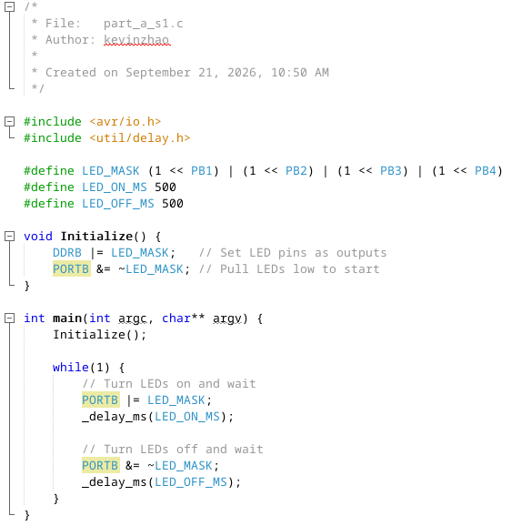
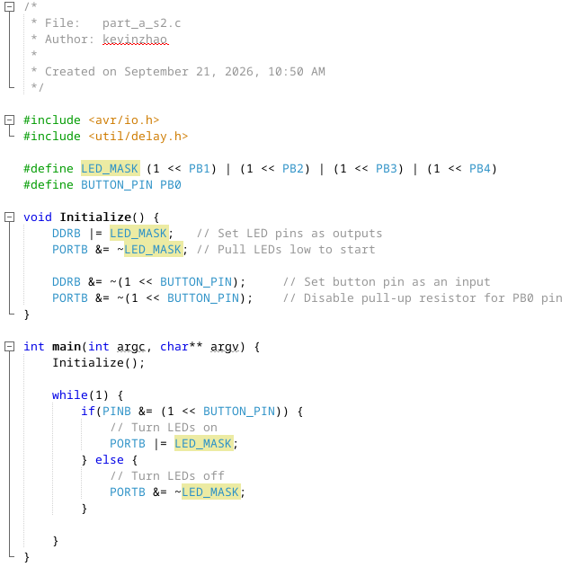
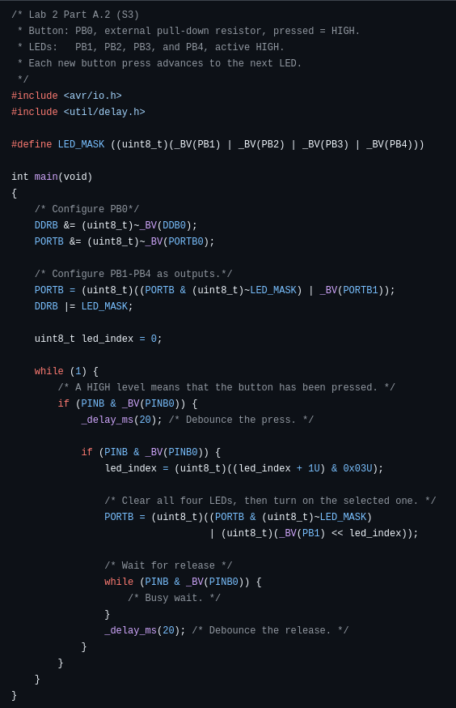
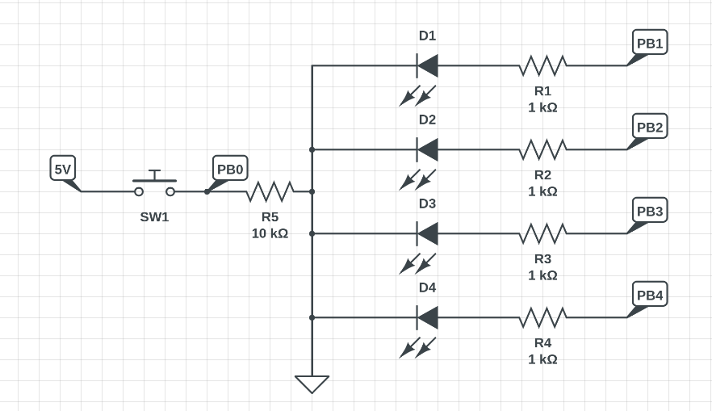

# Lab 2 Morse

**Team Name/Number: Team 46**

**GitHub Repository URL: [github.com/kzhao426/ese5190f26-lab2-t46.git](https://github.com/kzhao426/ese5190f26-lab2-t46.git)**

| Team Member Name | Email Address                  | GitHub Handle |
| ---------------- | ------------------------------ | ------------- |
| Liyan Luo        | ll0@engineering.upenn.edu      | liyanluo-penn |
| Kevin Zhao       | kzhao426@engineering.upenn.edu | kzhao426      |

# Questions

## Part A

### (S1)

### (S2)

Correction: the condition should be `if (PINB & (1 << BUTTON_PIN))` to read PB0 without writing to PINB.

### (S3)

### (S4)

## Part B

### (C1)

[lab2c1.c](lab2c1.c)

## Part C

### (R1)

| Time (ms) | Ticks     |
| --------- | --------- |
| 50        | 800,000   |
| 200       | 3,200,000 |
| 400       | 6,400,000 |

### (R2)

A prescaler divides the microcontroller clock before it reaches the timer, so the timer counts more slowly and measures longer intervals before overflowing. The tradeoff is lower timing resolution; with a 1/1024 prescaler at 16 MHz, each tick is 64 us and Timer1 overflows after about 4.19 s instead of 4.10 ms.

## Part D

### (I1)

Pending: circuit photo (R1 = 1 kOhm, R2 = 10 kOhm).

### (I2)

Pending: oscilloscope capture with C1 = 1 nF.

### (I3)

Pending: oscilloscope capture with C1 = 10 nF.

### (R3)

The 10 nF capacitor is better for debouncing. With the same resistance, its RC time constant is ten times larger than with 1 nF, so it smooths fast voltage changes more effectively but responds more slowly.

## Part E

### (C2)

[lab2c2.c](lab2c2.c)

The dash upper limit was increased from 400 ms to 800 ms to make manual input easier.

## Part F

### (C3)

[lab2c3.c](lab2c3.c)

Message: `HELLO WORLD 12345` (12 unique characters).

### (T2)

Pending: TA demo.
